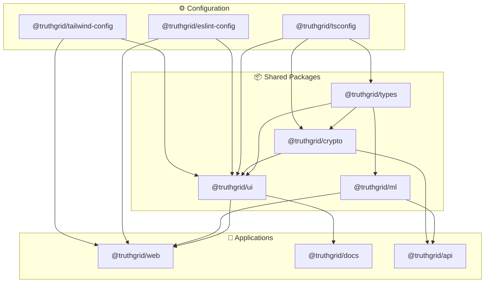

# TRUTHGRID Agent Development Guide

**Repository**: truthgrid-monorepo  
**Package Manager**: pnpm 8.15+  
**Build System**: Turborepo  
**Last Updated**: 2026-02-12

---

## Quick Start

```bash
# Install pnpm if needed
npm install -g pnpm

# Clone and setup
git clone <repo> truthgrid
cd truthgrid
pnpm install

# Run dev servers (all apps)
pnpm dev

# Run specific app
pnpm --filter @truthgrid/web dev

# Build everything
pnpm build

# Run tests
pnpm test
```

---

## Monorepo Architecture

### Directory Structure

```mermaid
tree
  root["📁 truthgrid/"]
    apps["📂 apps/"]
      web["📁 @truthgrid/web"]
        app["📂 app/"]
        components["📂 components/"]
        public["📂 public/"]
        pkg["📄 package.json"]
      docs["📁 @truthgrid/docs"]
      api["📁 @truthgrid/api"]
    packages["📂 packages/"]
      ui["📁 @truthgrid/ui"]
      crypto["📁 @truthgrid/crypto"]
      types["📁 @truthgrid/types"]
      eslint["📁 @truthgrid/eslint-config"]
      tsconfig["📁 @truthgrid/tsconfig"]
      tailwind["📁 @truthgrid/tailwind-config"]
    tooling["📂 tooling/"]
    root_pkg["📄 package.json"]
    pnpm["📄 pnpm-workspace.yaml"]
    turbo["📄 turbo.json"]
```

### Package Dependency Graph



### Workspace Configuration

```yaml
# pnpm-workspace.yaml
packages:
  - 'apps/*'
  - 'packages/*'
```

```json
// package.json (root)
{
  "name": "truthgrid",
  "private": true,
  "packageManager": "pnpm@8.15.0",
  "scripts": {
    "build": "turbo run build",
    "dev": "turbo run dev --parallel",
    "lint": "turbo run lint",
    "test": "turbo run test",
    "typecheck": "turbo run typecheck",
    "format": "prettier --write .",
    "clean": "turbo run clean && rm -rf node_modules"
  },
  "devDependencies": {
    "@truthgrid/eslint-config": "workspace:*",
    "prettier": "^3.0.0",
    "turbo": "^1.12.0"
  }
}
```

```json
// turbo.json
{
  "$schema": "https://turbo.build/schema.json",
  "globalDependencies": ["**/.env.*local"],
  "pipeline": {
    "build": {
      "dependsOn": ["^build"],
      "outputs": [".next/**", "!.next/cache/**", "dist/**"]
    },
    "dev": {
      "cache": false,
      "persistent": true
    },
    "lint": {},
    "test": {
      "dependsOn": ["build"]
    },
    "typecheck": {
      "dependsOn": ["^build"]
    }
  }
}
```

---

## Package Guidelines

### Creating a New Package

```bash
# From root
mkdir -p packages/my-package/src
cd packages/my-package

# Create package.json
cat > package.json << 'EOF'
{
  "name": "@truthgrid/my-package",
  "version": "0.0.0",
  "main": "./dist/index.js",
  "module": "./dist/index.mjs",
  "types": "./dist/index.d.ts",
  "exports": {
    ".": {
      "import": "./dist/index.mjs",
      "require": "./dist/index.js",
      "types": "./dist/index.d.ts"
    }
  },
  "scripts": {
    "build": "tsup src/index.ts --format cjs,esm --dts",
    "dev": "tsup src/index.ts --format cjs,esm --dts --watch",
    "lint": "eslint .",
    "clean": "rm -rf dist"
  },
  "devDependencies": {
    "@truthgrid/tsconfig": "workspace:*",
    "tsup": "^8.0.0",
    "typescript": "^5.3.0"
  }
}
EOF

# Create tsconfig.json
echo '{ "extends": "@truthgrid/tsconfig/base.json" }' > tsconfig.json

# Create entry point
mkdir -p src
touch src/index.ts
```

### Inter-Package Dependencies

```json
// packages/ui/package.json
{
  "dependencies": {
    "@truthgrid/types": "workspace:*",
    "@truthgrid/crypto": "workspace:*"
  }
}
```

```typescript
// packages/ui/src/components/EventCard.tsx
import type { MaterialLossEvent } from '@truthgrid/types';
import { truncateHash } from '@truthgrid/crypto';
```

---

## Development Workflows

### Adding a Feature

1. **Create branch**:
   ```bash
   git checkout -b feature/event-filtering
   ```

2. **Identify packages affected**:
   - `apps/web` - UI changes
   - `packages/types` - New type definitions
   - `packages/crypto` - Hashing utilities

3. **Make changes** with tests

4. **Verify in dependent packages**:
   ```bash
   pnpm --filter @truthgrid/web... build
   ```

5. **Commit with conventional message**:
   ```bash
   git commit -m "feat(web): add event filtering by date range"
   ```

### Debugging

```bash
# Run single test file
pnpm --filter @truthgrid/crypto test src/merkle.test.ts

# Type check single package
pnpm --filter @truthgrid/types typecheck

# Build with verbose output
pnpm build -- --verbose
```

### Dependency Management

```bash
# Add dependency to specific package
pnpm --filter @truthgrid/web add lodash

# Add dev dependency to root
pnpm add -D eslint -w

# Update all dependencies
pnpm update --recursive

# Check for outdated
pnpm outdated --recursive
```

---

## Common Tasks

### Component Development

```typescript
// packages/ui/src/components/EventBadge.tsx
import { cva, type VariantProps } from 'class-variance-authority';
import { cn } from '../utils';

const badgeVariants = cva(
  'inline-flex items-center px-2 py-0.5 rounded text-xs font-mono',
  {
    variants: {
      status: {
        pending: 'bg-amber-500/10 text-amber-400 border border-amber-500/20',
        sealed: 'bg-purple-500/10 text-purple-400 border border-purple-500/20',
        valid: 'bg-green-500/10 text-green-400 border border-green-500/20',
      },
    },
    defaultVariants: {
      status: 'pending',
    },
  }
);

export interface EventBadgeProps
  extends VariantProps<typeof badgeVariants> {
  children: React.ReactNode;
}

export function EventBadge({ status, children }: EventBadgeProps) {
  return (
    <span className={cn(badgeVariants({ status }))}>
      {children}
    </span>
  );
}
```

### Hook Development

```typescript
// packages/ui/src/hooks/useEventStream.ts
import { useState, useEffect, useCallback } from 'react';
import type { LedgerEntry } from '@truthgrid/types';

interface UseEventStreamOptions {
  seed?: string;
  count?: number;
}

interface UseEventStreamReturn {
  events: LedgerEntry[];
  isLoading: boolean;
  error: Error | null;
  refresh: () => void;
}

export function useEventStream(
  options: UseEventStreamOptions = {}
): UseEventStreamReturn {
  const { seed = '0xFA11', count = 100 } = options;
  const [events, setEvents] = useState<LedgerEntry[]>([]);
  const [isLoading, setIsLoading] = useState(true);
  const [error, setError] = useState<Error | null>(null);

  const loadEvents = useCallback(async () => {
    setIsLoading(true);
    setError(null);
    
    try {
      const response = await fetch(`/api/v1/events?seed=${seed}&count=${count}`);
      const data = await response.json();
      setEvents(data.events);
    } catch (e) {
      setError(e as Error);
    } finally {
      setIsLoading(false);
    }
  }, [seed, count]);

  useEffect(() => {
    void loadEvents();
  }, [loadEvents]);

  return {
    events,
    isLoading,
    error,
    refresh: loadEvents,
  };
}
```

---

## Build & Deploy

### Local Production Build

```bash
# Build everything
pnpm build

# Test production build locally
cd apps/web
pnpm start
```

### CI/CD Pipeline

```yaml
# .github/workflows/ci.yml
name: CI

on:
  push:
    branches: [main]
  pull_request:
    branches: [main]

jobs:
  build:
    runs-on: ubuntu-latest
    steps:
      - uses: actions/checkout@v4
      - uses: pnpm/action-setup@v2
      - uses: actions/setup-node@v4
        with:
          node-version: '20'
          cache: 'pnpm'
      
      - run: pnpm install
      - run: pnpm lint
      - run: pnpm typecheck
      - run: pnpm test
      - run: pnpm build
      
      - name: Upload build artifacts
        uses: actions/upload-artifact@v4
        with:
          name: build
          path: |
            apps/web/.next
            packages/*/dist
```

---

## Environment Variables

### App-Specific (.env.local in app directory)

```bash
# apps/web/.env.local
NEXT_PUBLIC_API_URL=https://api.truthgrid.io
NEXT_PUBLIC_WS_URL=wss://ws.truthgrid.io
```

### Shared (root .env)

```bash
# .env
TURBO_TOKEN=***
TURBO_TEAM=truthgrid
```

---

## Troubleshooting

### Common Issues

**Issue**: Changes in package not reflecting in app
```bash
# Rebuild the package
pnpm --filter @truthgrid/ui build

# Or watch mode
pnpm --filter @truthgrid/ui dev
```

**Issue**: Type errors across packages
```bash
# Clean and rebuild
pnpm clean
pnpm install
pnpm build
```

**Issue**: Lockfile conflicts
```bash
# Regenerate lockfile
rm pnpm-lock.yaml
pnpm install
```

---

## Code Generation

### Creating a New Component

```bash
# Use the generator script
pnpm gen:component packages/ui/src/components/EventList

# Creates:
# - EventList.tsx
# - EventList.test.tsx
# - index.ts
```

### Scaffolds

```typescript
// Component scaffold
touch "$1.tsx" "$1.test.tsx" "index.ts"

// Template for Component.tsx
cat > "$1.tsx" << 'EOF'
import { cn } from '@/lib/utils';

interface ${1##*/}Props {
  className?: string;
}

export function ${1##*/}({ className }: ${1##*/}Props): JSX.Element {
  return (
    <div className={cn('', className)}>
      {/* Implementation */}
    </div>
  );
}
EOF
```

---

## Performance

### Bundle Analysis

```bash
# Analyze web app bundle
pnpm --filter @truthgrid/web analyze

# View in browser
open apps/web/.next/analyze/client.html
```

### Dependency Size Check

```bash
# Check package sizes
pnpm --filter @truthgrid/web build
npx bundlesize
```

---

## Resources

- [Turborepo Docs](https://turbo.build/repo/docs)
- [pnpm Workspaces](https://pnpm.io/workspaces)
- [Changesets](https://github.com/changesets/changesets) - Version management
- [CODING-STANDARDS.md](./CODING-STANDARDS.md) - Code conventions
- [PROJECT-ROADMAP.md](./PROJECT-ROADMAP.md) - Product roadmap

---

## ML Services Architecture

Based on analysis of 300+ ML system design case studies from leading companies (Stripe, Wayfair, Uber, etc.), TRUTHGRID implements the following ML patterns:

### Anomaly Detection Service

Real-time event anomaly detection using embeddings and centroid-based scoring.

```typescript
// packages/ml/src/anomaly-detector.ts
export class AnomalyDetector {
  private embeddingModel: EventEmbeddingModel;
  private centroidTracker: CentroidTracker;
  
  async detect(event: MaterialLossEvent): Promise<AnomalyResult> {
    // 1. Generate event embedding (128-dim)
    const embedding = await this.embeddingModel.embed(event);
    
    // 2. Compare to factory centroid
    const centroid = await this.centroidTracker.getCentroid(event.factoryId);
    const distance = cosineDistance(embedding, centroid);
    
    // 3. Score anomaly
    const score = this.calculateAnomalyScore(distance, event);
    
    return {
      isAnomalous: score > this.threshold,
      score,
      confidence: this.calculateConfidence(event),
      similarEvents: await this.findSimilarEvents(embedding, 5),
      explanation: this.generateExplanation(event, score)
    };
  }
}

// Usage
const detector = new AnomalyDetector();
const result = await detector.detect(event);

if (result.isAnomalous) {
  console.warn(`Anomaly detected: ${result.explanation}`);
}
```

**Key Metrics**:
- Latency: < 50ms per event
- Precision: > 95%
- Recall: > 90%

### Entity Risk Profiling

Factory, operator, and device risk profiling based on Uber's Risk Entity Watch pattern.

```typescript
// packages/ml/src/risk-profiler.ts
interface EntityRiskProfile {
  entityId: string;
  entityType: 'factory' | 'operator' | 'device';
  baseRiskScore: number;  // 0-100
  temporalProfile: {
    hourlyPattern: number[];     // 24-hour activity pattern
    dayOfWeekPattern: number[];  // 7-day pattern
    seasonalPattern: number[];   // 12-month pattern
  };
  networkRisk: {
    associatedEntities: string[];
    sharedDeviceCount: number;
    crossFactoryActivity: boolean;
  };
  history: {
    totalEvents: number;
    anomalousEvents: number;
    auditFindings: Finding[];
  };
}

export class RiskProfiler {
  async generateProfile(entityId: string): Promise<EntityRiskProfile> {
    const events = await this.fetchEntityEvents(entityId);
    const temporalFeatures = this.extractTemporalFeatures(events);
    const networkFeatures = await this.analyzeNetwork(entityId);
    
    return {
      entityId,
      baseRiskScore: this.calculateBaseRisk(events),
      temporalProfile: temporalFeatures,
      networkRisk: networkFeatures,
      history: this.summarizeHistory(events)
    };
  }
}
```

### Schema Inference Service

LLM-powered schema detection based on Grab's data classification system.

```typescript
// packages/ml/src/schema-inference.ts
export class SchemaInferenceService {
  private llm: LLMClient;
  
  async inferSchema(sampleEvents: unknown[]): Promise<InferredSchema> {
    const prompt = `
      Analyze these factory event samples and infer:
      1. JSON schema
      2. Field types and constraints
      3. Sensitive fields (PII/PCI)
      4. Recommended hash fields for cryptographic integrity
      
      Events: ${JSON.stringify(sampleEvents, null, 2)}
    `;
    
    const response = await this.llm.complete(prompt);
    return this.parseSchemaResponse(response);
  }
}

// Usage for new factory onboarding
const inference = new SchemaInferenceService();
const schema = await inference.inferSchema(sampleEvents);

console.log(schema.inferredSchema);
console.log(schema.sensitiveFields);  // Auto-detected PII
console.log(schema.confidence);       // Human review if < 0.9
```

### Feature Store

Centralized feature management following Stripe Radar patterns.

```typescript
// packages/ml/src/feature-store.ts
export class FeatureStore {
  async getFeatures(entityId: string): Promise<FeatureVector> {
    // Real-time features
    const realtime = await this.computeRealtimeFeatures(entityId);
    
    // Batch features (pre-computed)
    const batch = await this.fetchBatchFeatures(entityId);
    
    // Temporal aggregations
    const temporal = await this.computeTemporalFeatures(entityId);
    
    return {
      ...realtime,
      ...batch,
      ...temporal,
      _metadata: {
        computedAt: Date.now(),
        version: '2.1.0'
      }
    };
  }
}
```

### Model Deployment Patterns

```typescript
// packages/ml/src/model-registry.ts
export class ModelRegistry {
  async loadModel(name: string, version: string): Promise<MLModel> {
    // Load from S3/artifact store
    const artifact = await this.fetchArtifact(name, version);
    
    // Verify checksum
    if (!verifyChecksum(artifact, expectedHash)) {
      throw new Error('Model checksum mismatch');
    }
    
    return this.loadModelFromBytes(artifact);
  }
  
  async deploy(name: string, version: string, traffic: number): Promise<void> {
    // Gradual rollout (canary deployment)
    await this.updateTrafficSplit(name, {
      [version]: traffic,
      stable: 100 - traffic
    });
  }
}
```

### Monitoring & Observability

```typescript
// packages/ml/src/monitoring.ts
export class ModelMonitor {
  trackPrediction(input: unknown, output: unknown, latency: number): void {
    // Log to monitoring system
    this.metrics.histogram('ml.prediction.latency', latency);
    this.metrics.counter('ml.prediction.count', 1);
    
    // Feature drift detection
    this.checkFeatureDrift(input);
    
    // Output distribution tracking
    this.trackOutputDistribution(output);
  }
  
  private checkFeatureDrift(input: unknown): void {
    const currentDistribution = this.calculateDistribution(input);
    const referenceDistribution = this.getReferenceDistribution();
    
    const driftScore = calculateKL Divergence(
      currentDistribution,
      referenceDistribution
    );
    
    if (driftScore > this.driftThreshold) {
      this.alert('Feature drift detected', { driftScore });
    }
  }
}
```

---

## Industry Pattern References

Key case studies informing TRUTHGRID architecture:

| Company | Pattern | Application |
|---------|---------|-------------|
| **Stripe** | Real-time fraud scoring | Sub-100ms verification pipeline |
| **Wayfair** | Embedding-based detection | Customer journey anomaly detection |
| **Uber** | Entity risk watch | Factory/operator risk profiling |
| **Grab** | LLM data classification | Automated schema inference |
| **Microsoft** | Incident management | Automated audit discrepancy analysis |
| **DoorDash** | Cascade ML | Multi-layer verification (fast → thorough) |

See [ML-SYSTEM-DESIGN-ANALYSIS.md](./ML-SYSTEM-DESIGN-ANALYSIS.md) for detailed analysis.

---

**Need help?** Open an issue or ping `@team` in Slack.
