# FAB-SIM — Deterministic Manufacturing Telemetry

**Brand**: TRUTHGRID  
**Stack**: React 19 + TypeScript + Vite + TailwindCSS + GSAP  
**Routing**: Hash-based (`/#/`, `/#/console`)

---

## Vision

TRUTHGRID provides audit-grade duty recovery through deterministic manufacturing telemetry. FAB-SIM generates reproducible factory events with cryptographic provenance; DutyOS reconciles them into provable, sealed claims backed by Merkle proofs and immutable audit trails.

---

## Architecture

```
app/src/
├── pages/
│   ├── LandingPage.tsx           # Editorial landing experience
│   └── ConsolePage.tsx           # Dense terminal UI (lazy-loaded)
├── components/
│   ├── editorial/                # Landing page sections
│   │   ├── HeroSection.tsx       # Full-viewport hero with massive typography
│   │   ├── ProductStrip.tsx      # FAB-SIM / DutyOS / Trust cards
│   │   ├── StatsStrip.tsx        # Animated counters
│   │   ├── ProcessTimeline.tsx   # 4-step pipeline visualization
│   │   ├── DemoSection.tsx       # Split CTA with form
│   │   └── ConsolePreview.tsx    # Terminal mockup component
│   ├── console/                  # Console UI components
│   │   ├── EventTape.tsx         # Time-series event table
│   │   ├── MerkleExplorer.tsx    # Merkle tree visualization
│   │   ├── LineageGraph.tsx      # Event→Calc→Seal flow
│   │   └── EvidenceDrawer.tsx    # Event detail panel
│   └── ui/                       # shadcn/ui primitives
├── hooks/
│   ├── useGsapReveal.ts          # Scroll-triggered reveal
│   ├── useGsapHoverPress.ts      # Hover/press micro-interactions
│   ├── useGsapTerminal.ts        # Terminal typing effect
│   └── useCountUp.ts             # Animated counter
├── lib/
│   ├── crypto.ts                 # SHA-256, hex conversion
│   ├── merkle.ts                 # Merkle tree construction
│   ├── sampleData.ts             # Mock ledger generation
│   └── gsap/                     # GSAP configuration
└── types/
    └── index.ts                  # Domain types
```

### Data Flow

```mermaid
flowchart TD
    A[Landing Page<br/>editorial components] -->|User clicks "View Console"| B[Lazy-loaded<br/>ConsolePage chunk]
    B --> C[generateSampleLedger]
    C --> D[LedgerEntry[]]
    D --> E[EventTape]
    D --> F[MerkleExplorer]
    D --> G[LineageGraph]
    E --> H[User selects event]
    F --> H
    G --> H
    H --> I[EvidenceDrawer]
```

---

## Design System

### Typography

| Role | Font | Usage |
|------|------|-------|
| Display | Instrument Serif (italic) | Headlines 80px–120px |
| UI | Inter (sans-serif) | Buttons, labels, body |
| Data | JetBrains Mono | Console, hashes, code |

```typescript
// Tailwind classes
<h1 className="font-display text-6xl lg:text-8xl 2xl:text-9xl leading-[0.9]">
<p className="font-sans text-sm">
<code className="font-mono text-xs">
```

### Color Palette

**Base**
- Background: `#020408` (near-black)
- Surface: `bg-slate-900/40`
- Border: `border-slate-800`

**Status**
- Primary: `text-blue-400` (#3b82f6)
- Success: `text-green-400` (#10b981)
- Sealed: `text-purple-400` (#8b5cf6)
- Warning: `text-amber-400` (#f59e0b)

**Editorial Accents**
- FAB-SIM: `from-editorial-orange-dark to-editorial-orange` (burnt orange)
- DutyOS: `from-editorial-cobalt-dark to-editorial-cobalt` (deep blue)
- Trust: `from-editorial-yellow-dark to-editorial-yellow` (gold)

### Animation Standards

```typescript
// Mandatory reduced-motion check
function prefersReducedMotion(): boolean {
  return window.matchMedia?.("(prefers-reduced-motion: reduce)")?.matches ?? false;
}

// Timing
const ANIMATION_CONFIG = {
  duration: 0.55,        // 0.25–0.6s range
  ease: "power2.out",    // Crisp, no bounce
  stagger: 0.06,         // Subtle
  yOffset: 12,           // Small movements
};
```

**Forbidden**: elastic/bounce easings, scale > 1.05, duration > 1s

---

## Landing Page Spec

### Hero Section

- Full viewport height (`min-h-screen`)
- Single `<h1>` with `<span className="block">` children
- Leading: `leading-[0.9]` (tight editorial)
- Breakpoints: `text-5xl sm:text-6xl lg:text-7xl xl:text-8xl 2xl:text-9xl`
- Navigation: `mix-blend-difference backdrop-blur-sm bg-black/20`
- Console preview floats right with glow effect

### Product Strip

**FAB-SIM Card** (orange theme)
- Left: Content with feature list
- Right: Device mockup with event stream
- Min-height: 500px

**DutyOS Card** (cobalt theme)
- Left: Merkle tree visualization mockup
- Right: Content with feature list
- Asymmetric layout (reversed)

**Trust Section** (gold theme)
- 3-column grid of proof cards
- Icons: Database, Lock, Activity

### Stats Strip

- 4-column grid (2 on mobile)
- Animated count-up on scroll
- Sparkline SVG below each stat
- Live pulse indicator

### Process Timeline

- Vertical timeline with animated progress line
- Auto-advancing steps (3s interval)
- IntersectionObserver-gated (pause when off-screen)
- Active/past states with different styling

### Demo Section

- Split layout: Benefits left, form right
- Form with validation
- Success state with confirmation

---

## Console Spec

### Layout

**Desktop (lg+)**

```mermaid
block-beta
  columns 3
  EventTape["📊 Event Tape"] space Merkle["🔐 Merkle<br/>Explorer"]
  space space Evidence["📋 Evidence<br/>Drawer"]
  EventTape space Lineage["🔗 Lineage<br/>Graph"]
  space space Evidence
```



**Tablet (md-lg)**

```mermaid
block-beta
  columns 2
  ActiveTab["📱 Active Tab<br/>(tape/merkle/lineage)"] Evidence["📋 Evidence<br/>Drawer"]
```



**Mobile (<md)**
- Full-width tab content
- Evidence drawer below

### Components

**EventTape**
- Dense monospace table
- Columns: Seq, Time, Type, Hash, Source
- Row selection highlights
- Scrollable with custom scrollbar

**MerkleExplorer**
- Tree visualization (collapsible)
- Root hash with VALID badge
- Click nodes to view details

**LineageGraph**
- SVG with 3 lanes (EVENT → CALC → SEALED)
- Curved connector lines
- Node selection

**EvidenceDrawer**
- Event JSON (formatted)
- Derived hash
- Schema version
- Links to Merkle/Lineage

---

## Crypto Spec

### Domain Types

```typescript
type Hex = `0x${string}`;

interface MaterialLossEvent {
  seq: number;
  timestamp: string;
  type: "MATERIAL_LOSS" | "DUTY_SEALED";
  eventHash: Hex;
  source: string;
  data: {
    materialType: string;
    quantity: number;
    unitValue: number;
  };
}

interface LedgerEntry {
  seq: number;
  timestamp: string;
  eventHash: Hex;
  previousHash: Hex;
  merkleRoot: Hex;
  entryType: string;
  source: string;
}
```

### Hashing

```typescript
// SHA-256 via WebCrypto
async function sha256Bytes(data: Uint8Array): Promise<Uint8Array>;
async function sha256Hex(parts: Uint8Array[]): Promise<Hex>;

// Deterministic serialization
function stableStringify(obj: unknown): string;

// Event hash
async function hashEvent(event: MaterialLossEvent): Promise<Hex> {
  const canonical = stableStringify(event);
  return sha256Hex([utf8(canonical)]);
}
```

### Merkle Tree

```typescript
interface MerkleNode {
  id: string;
  hash: Hex;
  left?: MerkleNode;
  right?: MerkleNode;
  level: number;
}

// Build tree with duplicate-last-leaf for odd counts
async function buildMerkleTree(leaves: Hex[]): Promise<MerkleNode>;
```

---

## Component Inventory

| File | Responsibility |
|------|----------------|
| `HeroSection.tsx` | Full-viewport hero, massive typography, console preview |
| `ProductStrip.tsx` | FAB-SIM/DutyOS/Trust color-blocked cards |
| `StatsStrip.tsx` | Animated counters with sparklines |
| `ProcessTimeline.tsx` | Auto-advancing 4-step pipeline |
| `DemoSection.tsx` | Demo request form with benefits |
| `ConsolePreview.tsx` | Terminal mockup for hero |
| `ConsolePage.tsx` | Lazy-loaded console shell |
| `EventTape.tsx` | Time-series event table |
| `MerkleExplorer.tsx` | Interactive Merkle tree |
| `LineageGraph.tsx` | SVG flow diagram |
| `EvidenceDrawer.tsx` | Event detail side panel |

---

## Design References

### Nitro Editorial (Visual Inspiration)
- Large serif headlines (Instrument Serif)
- Full-bleed color sections
- Asymmetric layouts
- Minimal navigation
- Scroll-triggered reveals

### Bloomberg Terminal (Functional Inspiration)
- Dense monospace data
- Color-coded status badges
- Dark background priority
- Tabular number alignment
- Information density over whitespace

---

## Acceptance Criteria

- [ ] Landing page loads with Instrument Serif headlines
- [ ] Console lazy-loads as separate chunk (check Network tab)
- [ ] Math.random() removed from ProductStrip (no flicker)
- [ ] ProcessTimeline pauses when off-screen
- [ ] Reduced motion disables all animations
- [ ] All sections use content-visibility
- [ ] Stats counters animate on scroll
- [ ] Form validates and shows success state
- [ ] No TypeScript errors (`npm run build`)
- [ ] Mobile responsive (375px, 768px, 1024px, 1440px+)

---

## Commands

```bash
# Development
cd app && npm run dev

# Build
npm run build

# Lint
npm run lint

# Preview production build
npm run preview
```

---

## Documentation

- `CODING-STANDARDS.md` — Code conventions and patterns
- `AGENTS.md` — Agent development guide
- `SHOWCASE-GUIDE.md` — Quick reference for demo

---

**TRUTHGRID** — Deterministic Audit Infrastructure
