# TRUTHGRID — Project Roadmap

**Status**: MVP Complete | **Stage**: Pre-Seed | **Last Updated**: 2026-02-12

---

## Executive Summary

TRUTHGRID is a deterministic manufacturing telemetry platform that generates cryptographically verifiable audit trails for duty recovery. The product consists of:

- **FAB-SIM**: Factory event simulation engine with reproducible seeds
- **DutyOS**: Reconciliation engine with Merkle proof verification
- **Console**: Interactive audit interface for compliance teams

**Traction**: Demo-ready, seeking design partners in manufacturing/trade verticals.

---

## Product Architecture

### Monorepo Structure (pnpm workspaces)

```
truthgrid/
├── apps/
│   ├── web/                    # Next.js marketing + console app
│   ├── docs/                   # Docusaurus documentation
│   └── api/                    # FastAPI deterministic replay service
├── packages/
│   ├── ui/                     # Shared component library
│   ├── crypto/                 # WASM Merkle tree + hashing
│   ├── types/                  # Shared TypeScript definitions
│   ├── eslint-config/          # Shared lint rules
│   └── tsconfig/               # Shared TS configurations
├── tooling/
│   └── terraform/              # Infrastructure as code
└── .github/
    └── workflows/              # CI/CD pipelines
```

### Technology Stack

| Layer | Technology | Rationale |
|-------|------------|-----------|
| Frontend | React 19 + Vite | Performance, modern patterns |
| Styling | TailwindCSS 3.x | Design system consistency |
| Animation | GSAP 3.x + Web Animations API | 60fps, reduced-motion support |
| Crypto | WebCrypto API + WASM | Browser-native, auditable |
| ML/AI | Python + ONNX Runtime | Real-time inference, model serving |
| Backend | FastAPI + PostgreSQL | Async Python, type safety |
| Infrastructure | Vercel + AWS | Edge deployment, scalability |

### ML Architecture (Based on Industry Best Practices)

Based on analysis of 300+ ML system design case studies from Stripe, Wayfair, Uber, and others:

```mermaid
block-beta
  columns 3
  block:group1:3
    columns 3
    Anomaly["🎯 Anomaly Detection<br/>&lt;50ms"] Risk["👤 Risk Profiling<br/>Entity-based"] Schema["🧠 Schema Inference<br/>LLM-powered"]
    Graph["🕸️ Graph Analysis<br/>Fraud detection"] Predictive["📅 Predictive Scheduling<br/>Time-series"] Feature["⚡ Feature Store<br/>Real-time"]
  end
```



**Reference Patterns**:
- **Stripe Radar**: Real-time fraud scoring pipeline
- **Wayfair Melange**: Embedding-based anomaly detection
- **Uber Risk Entity Watch**: Entity-centric risk profiling
- **Grab LLM Classification**: Automated schema inference

---

## Current State (MVP)

### ✅ Completed

- [x] Editorial landing page (Hero, Product, Stats, Timeline, Demo)
- [x] Interactive console (Event Tape, Merkle Explorer, Lineage Graph)
- [x] Deterministic hash chain simulation
- [x] Responsive design (mobile → ultra-wide)
- [x] Performance optimizations (lazy loading, content-visibility)
- [x] Accessibility (reduced-motion, keyboard navigation)

### 📊 Metrics

| Metric | Value | Target |
|--------|-------|--------|
| Lighthouse Performance | 95+ | 95+ |
| First Contentful Paint | <1.5s | <1.5s |
| Bundle Size (landing) | 282KB | <300KB |
| Console Chunk | 42KB (lazy) | <50KB |
| Type Coverage | 100% | 100% |

---

## Phase 1: Foundation (Completed)

### Week 1-2: Core Product

**Deliverables**:
- Landing page with editorial aesthetic
- Console with 3-pane layout
- Deterministic event simulation
- Merkle tree visualization

**Key Decisions**:
- Hash-based routing for static deployment
- GSAP for animations with reduced-motion fallback
- Instrument Serif for brand differentiation
- Color-blocked product sections for visual hierarchy

---

## Phase 2: Infrastructure (Next 4 Weeks)

### Week 3: Monorepo Migration

**Scope**: Restructure to pnpm workspaces

```bash
# Target structure
apps/
  web/           # Migrate current app
  docs/          # New documentation site
packages/
  ui/            # Extract shared components
  crypto/        # WASM crypto primitives
  types/         # Shared interfaces
```

**Success Criteria**:
- Zero regression in functionality
- Shared packages consumable by all apps
- Turborepo for build orchestration

### Week 4: Documentation

**Deliverables**:
- Technical architecture docs
- API reference
- Deployment guide
- Contribution guidelines

### Week 5: Testing Infrastructure

**Scope**:
- Unit tests (Vitest) for crypto utilities
- Component tests (React Testing Library)
- E2E tests (Playwright) for critical paths
- Visual regression (Chromatic)

**Coverage Targets**:
- Crypto: 100%
- Components: 80%
- E2E: Critical user journeys

### Week 6: CI/CD Pipeline

**GitHub Actions**:
```yaml
# PR Workflow
- Type check
- Lint
- Unit tests
- Build
- Deploy preview

# Main Workflow
- All PR checks
- E2E tests
- Deploy production
- Purge CDN cache
```

---

## Phase 3: Product Expansion (Weeks 7-12)

### Week 7-8: Backend Services

**FastAPI Services**:
```python
# Deterministic Replay API
POST /api/v1/replay
{
  "seed": "0xFA11",
  "eventCount": 1000,
  "schemaVersion": "2.1"
}

# Merkle Verification API
POST /api/v1/verify
{
  "leaves": ["0x...", "0x..."],
  "root": "0x..."
}
```

**Database Schema**:
```sql
-- Events table with hash chain
CREATE TABLE events (
  seq SERIAL PRIMARY KEY,
  event_hash VARCHAR(66) UNIQUE NOT NULL,
  previous_hash VARCHAR(66) REFERENCES events(event_hash),
  merkle_root VARCHAR(66) NOT NULL,
  data JSONB NOT NULL,
  created_at TIMESTAMP DEFAULT NOW()
);
```

### Week 9-10: Enhanced Console

**Features**:
- Real-time WebSocket event stream
- Advanced filtering (date range, event type, source)
- CSV/JSON export with hash verification
- User authentication (Clerk)
- Audit log of console actions

### Week 11-12: Integration Layer

**Connectors**:
- ERP systems (SAP, Oracle)
- Customs platforms (ACE, CHIEF)
- Factory sensors (OPC-UA, MQTT)
- Cloud storage (S3, GCS) for sealed claims

---

## Phase 3.5: ML Intelligence (Weeks 13-18) [NEW]

Based on industry analysis from 300+ ML case studies.

### Week 13-14: Anomaly Detection (Stripe Radar Pattern)

**Objective**: Real-time event anomaly detection

**Architecture**:
```python
# FastAPI service
@app.post("/api/v1/analyze")
async def analyze_event(event: MaterialLossEvent):
    # Layer 1: Embedding generation (ONNX Runtime)
    embedding = await embedding_model.embed(event)
    
    # Layer 2: Centroid comparison
    centroid = await feature_store.get_centroid(event.factory_id)
    distance = cosine_distance(embedding, centroid)
    
    # Layer 3: Anomaly scoring
    score = anomaly_scorer.calculate(distance, event)
    
    return {
        "is_anomalous": score > threshold,
        "score": score,
        "confidence": calculate_confidence(event),
        "explanation": generate_explanation(event, score)
    }
```

**Metrics**:
- Latency: < 50ms p99
- Precision: > 95%
- Recall: > 90%

### Week 15-16: Entity Risk Profiling (Uber Pattern)

**Objective**: Factory/operator/device risk profiles

**Features**:
- Temporal pattern analysis (24h/7d/12mo cycles)
- Network risk scoring (shared devices, cross-factory)
- Historical audit finding correlation

```typescript
interface EntityRiskProfile {
  entityId: string;
  baseRiskScore: number;  // 0-100
  temporalProfile: {
    hourlyPattern: number[];
    dayOfWeekPattern: number[];
    seasonalPattern: number[];
  };
  networkRisk: {
    associatedEntities: string[];
    sharedDeviceCount: number;
  };
}
```

### Week 17-18: Schema Inference & Graph Analysis

**Schema Inference (Grab Pattern)**:
- LLM-powered schema detection from sample events
- Auto-detection of sensitive fields (PII/PCI)
- Confidence scoring for human review

**Graph Fraud Detection (Wayfair Pattern)**:
- Factory-operator-device relationship graphs
- Community detection for fraud ring identification
- Shared resource analysis

---

## Phase 4: Go-to-Market (Weeks 19-24)

### Week 13: Security Hardening

- SOC 2 Type I preparation
- Penetration testing
- Bug bounty program setup
- Security documentation

### Week 14: Performance at Scale

**Targets**:
- 10M events/day throughput
- <100ms API response time (p99)
- 99.9% uptime SLA

**Optimizations**:
- Redis caching layer
- Read replicas for queries
- Event sourcing pattern
- CDN edge caching

### Week 15: Enterprise Features

- SSO (SAML, OIDC)
- Role-based access control
- Custom audit reports
- API rate limiting
- Dedicated infrastructure option

### Week 16: Launch Preparation

- Pricing strategy
- Sales deck
- Case studies
- Demo environment
- Support infrastructure

---

## Technical Debt Tracking

| Item | Priority | Effort | Impact |
|------|----------|--------|--------|
| Monorepo migration | High | 3d | Maintainability |
| Test coverage | High | 5d | Confidence |
| WASM crypto | Medium | 3d | Performance |
| Storybook | Medium | 2d | Documentation |
| Analytics | Medium | 1d | Insights |
| Error tracking | High | 1d | Reliability |
| ML model monitoring | High | 3d | Production safety |
| Feature store setup | Medium | 5d | ML infrastructure |
| Model versioning | Medium | 2d | Reproducibility |
| Embedding pipeline | Medium | 4d | Anomaly detection |

---

## Risk Register

| Risk | Likelihood | Impact | Mitigation |
|------|------------|--------|------------|
| Crypto implementation flaws | Low | Critical | External audit, formal verification |
| Performance at scale | Medium | High | Load testing, horizontal scaling |
| Regulatory changes | Medium | Medium | Compliance monitoring, flexible schema |
| Key person dependency | Medium | High | Documentation, pair programming |
| Competition | High | Medium | Speed to market, differentiation |
| ML model drift | Medium | High | Monitoring, automated retraining |
| False positive overload | Medium | Medium | Threshold tuning, human review loop |
| LLM hallucination (schema) | Medium | Medium | Confidence scoring, human validation |

---

## Success Metrics (6 Months)

| Metric | Target |
|--------|--------|
| Design partners | 3-5 |
| Events processed | 1M+ |
| Claims sealed | 100K+ |
| Console MAU | 50+ |
| NPS score | 50+ |
| Revenue | $50K ARR |

---

## Funding Requirements

| Phase | Amount | Use |
|-------|--------|-----|
| Pre-seed (current) | $150K | 6 months runway, 2 founders |
| Seed | $1.5M | Team expansion, enterprise features |
| Series A | $8M | Scale sales, international |

---

## Team Structure (Target)

| Role | Phase 1 | Phase 2 | Phase 3 |
|------|---------|---------|---------|
| Engineering | 2 | 4 | 8 |
| Design | 1 | 1 | 2 |
| Product | 1 | 1 | 2 |
| Sales | 0 | 1 | 3 |
| Customer Success | 0 | 0 | 2 |

---

## Appendix

### A. Brand Guidelines
- Primary: TRUTHGRID (all caps)
- Font: Instrument Serif (display), Inter (UI), JetBrains Mono (data)
- Colors: Slate 950 (base), Blue 400 (primary), Purple 400 (sealed)

### B. Key Differentiators
1. Deterministic replay (same seed → same results)
2. Browser-side verification (no trusted server)
3. Merkle batch proofs (scalable verification)
4. Decimal precision (no floating-point errors)

### C. Competitive Landscape
- Traditional customs brokers: High cost, low transparency
- RPA solutions: Brittle, non-deterministic
- Blockchain: Overkill, performance issues
- TRUTHGRID: Purpose-built, auditable, performant

---

**Questions?** Contact: team@truthgrid.io
