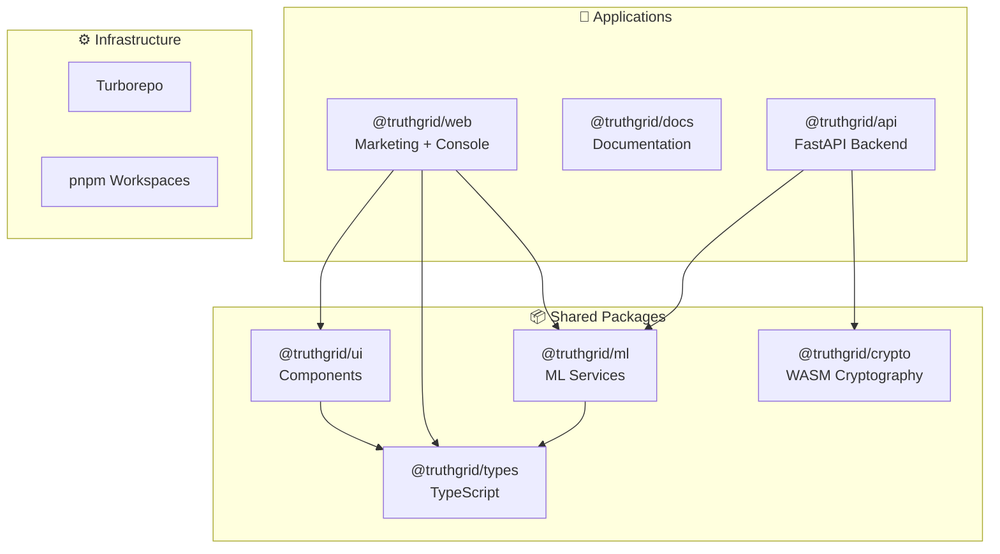

# TRUTHGRID

**Deterministic Manufacturing Telemetry for Audit-Grade Duty Recovery**

[](https://www.typescriptlang.org/)
[](https://react.dev/)
[](https://vitejs.dev/)
[](https://opensource.org/licenses/MIT)

---

## Overview

TRUTHGRID provides cryptographically verifiable audit trails for manufacturing and global trade. Our platform combines deterministic event simulation, Merkle-proof verification, and ML-based anomaly detection to ensure complete transparency in duty recovery processes.

### Key Products

- **FAB-SIM**: Factory event simulation engine with reproducible seeds
- **DutyOS**: Reconciliation engine with cryptographic verification
- **Audit AI**: ML-powered anomaly detection and risk profiling

---

## Quick Start

```bash
# Install pnpm
npm install -g pnpm

# Install dependencies
pnpm install

# Run development servers
pnpm dev

# Build for production
pnpm build
```

---

## Documentation

| Document | Purpose |
|----------|---------|
| [FAB-SIM.md](./FAB-SIM.md) | Technical specification |
| [AGENTS.md](./AGENTS.md) | Developer guide |
| [CODING-STANDARDS.md](./CODING-STANDARDS.md) | Code conventions |
| [PROJECT-ROADMAP.md](./PROJECT-ROADMAP.md) | Product roadmap |
| [ML-SYSTEM-DESIGN-ANALYSIS.md](./ML-SYSTEM-DESIGN-ANALYSIS.md) | ML architecture analysis |

---

## Architecture



---

## Features

### Current (MVP)

- ✅ Deterministic event simulation with cryptographic proofs
- ✅ Interactive console (Event Tape, Merkle Explorer, Lineage Graph)
- ✅ Responsive editorial landing page
- ✅ Performance optimized (lazy loading, content-visibility)
- ✅ Accessibility compliant (reduced-motion, keyboard nav)

### Planned (Q2 2026)

- 🚧 Real-time anomaly detection (Stripe Radar pattern)
- 🚧 Entity risk profiling (Uber pattern)
- 🚧 LLM-powered schema inference (Grab pattern)
- 🚧 Graph-based fraud detection (Wayfair pattern)

---

## Tech Stack

| Layer | Technology |
|-------|------------|
| Frontend | React 19 + TypeScript + Vite |
| Styling | TailwindCSS 3.x |
| Animation | GSAP 3.x |
| Crypto | WebCrypto API + WASM |
| ML | Python + ONNX Runtime |
| Backend | FastAPI + PostgreSQL |

---

## Contributing

See [CODING-STANDARDS.md](./CODING-STANDARDS.md) for development guidelines.

---

## Diagrams

This repository uses [Mermaid.js](https://mermaid.js.org/) for diagrams. To view them:

- **GitHub**: Renders automatically in README and markdown files
- **VS Code**: Install [Markdown Preview Mermaid Support](https://marketplace.visualstudio.com/items?itemName=bierner.markdown-mermaid) extension
- **Web**: Use [Mermaid Live Editor](https://mermaid.live/)

---

## License

MIT © 2026 TRUTHGRID
